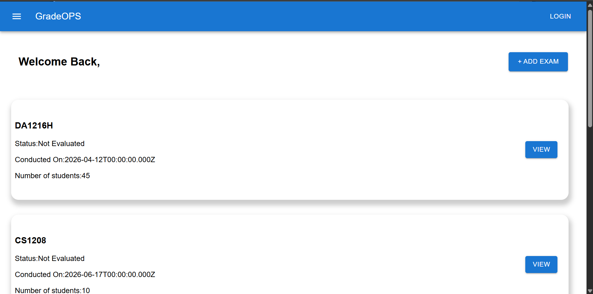
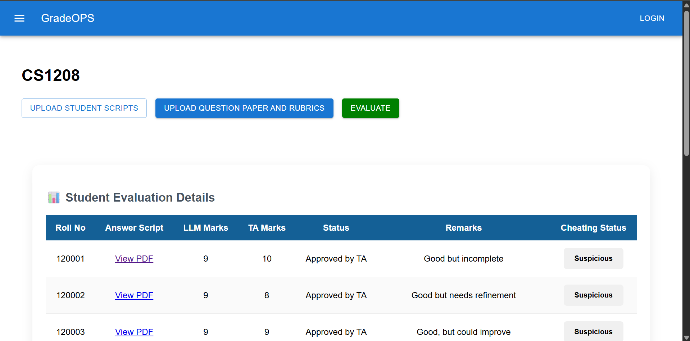
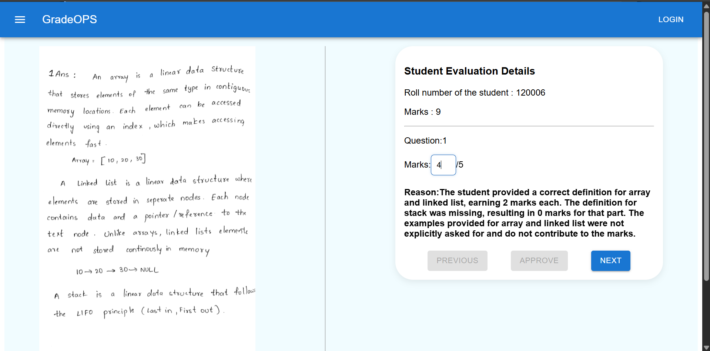

# GradeOPS

## Project Description

### GradeOPS is an AI-assisted answer script evaluation system designed to support instructors and teaching assistants in the grading process. The platform allows educators to manage examinations, upload student responses, and review marks through a centralized interface.

## Key Features

#### 📝 Intelligent Text Extraction from Answer Scripts

The system extracts handwritten or printed text from uploaded answer scripts using OCR (Optical Character Recognition), converting scanned documents into machine-readable text for further analysis and evaluation.

#### 🤖 AI-Powered Answer Script Evaluation

GradeOPS automatically evaluates student answer scripts using AI based on predefined grading criteria, significantly reducing manual grading effort and improving consistency.

#### 🔍 Cheating & Similarity Detection

The system analyzes student responses and identifies highly similar answers, helping instructors detect potential cases of plagiarism or academic dishonesty.

#### 👨‍🏫 Instructor & Teaching Assistant Dashboards

Separate dashboards are provided for Instructors and Teaching Assistants, ensuring role-based access and a streamlined workflow.

#### ✅ AI-Assisted Review and Approval

After AI evaluation, Teaching Assistants can review the generated marks, approve them directly, or overwrite them when human judgment is required.

#### 📋 Detailed Evaluation Explanations

For every question, the AI provides a detailed justification explaining why a particular score was awarded, increasing transparency and trust in the grading process.

#### 📄 Answer Script Review Interface

Teaching Assistants can view the original answer script alongside the AI-generated marks and evaluation explanations, enabling informed grading decisions.

#### ⚡ High-Speed Evaluation with Keyboard Shortcuts

GradeOPS supports keyboard shortcuts that allow Teaching Assistants to navigate, approve, and review answer scripts efficiently, accelerating the evaluation process.

#### 📊 Real-Time Evaluation Progress Tracking

Instructors can monitor the status of every answer script throughout the grading process, including pending reviews, approved evaluations, and overall progress.

## System Architecture

GradeOPS follows a client-server architecture with an AI-powered evaluation pipeline.

- React provides separate dashboards for Instructors and Teaching Assistants.
- Express.js handles API requests, authentication, exam management, and evaluation workflows.
- MongoDB stores exam details, answer scripts, extracted text, AI-generated marks, and final approved grades.
- The AI evaluation system is built using LangChain and LangGraph, enabling structured, multi-step answer assessment workflows.

### AI Evaluation Pipeline

1. Answer scripts are uploaded to the system.
2. OCR extracts text from the uploaded scripts.
3. LangGraph orchestrates the evaluation workflow.
4. LangChain processes extracted answers using Large Language Models.
5. The AI generates marks and detailed evaluation explanations for each question.
6. Similarity analysis is performed to identify potentially copied answers.
7. Teaching Assistants review the AI-generated marks, approve them, or overwrite them if necessary.
8. Instructors can monitor the evaluation status and grading progress in real time.

## Tech Stack
### Frontend

React.js  
JavaScript  

### Backend

Node.js  
Express.js  

### Database

MongoDB  
 
### AI & Machine Learning

Python  
LangChain  
LangGraph  
TensorFlow (OCR and text extraction)  
Large Language Models (LLMs)  

## Installation

### Clone the Repository  
git clone https://github.com/gdinesh1616/GradeOPS.git  
cd GradeOPS   
### Install Frontend Dependencies  
#### Open a terminal  

cd Frontend  
npm install  
npm run dev  

### Install Backend Dependencies  
#### Open a terminal  

cd Backend  
npm install  
npm start  

### Install Python Dependencies  
#### Open a terminal  

cd Evaluation  
pip install -r requirements.txt  
python -m uvicorn api:app --reload --port 8000    

### Configure Environmental Variables   
#### The project uses separate environment configurations for the Backend, Frontend and AI Evaluation services.  
### Frontend
VITE_API_URL=YOUR_BACKEND_URL. Example:http://localhost:5000  

### Backend (.env)  
CLOUD_NAME=YOUR_CLOUDINARY_CLOUD_NAME  
API_KEY=YOUR_CLOUDINARY_API_KEY  
API_SECRET=YOUR_CLOUDINARY_API_SECRET  
AI_SERVICE_URL=EXAMPLE:http://127.0.0.1:8000   
MONGO_URL=YOUR_MONGO_URL  
PORT=YOUR_BACKEND_PORT

### Evaluation(.env)  
GOOGLE_API_KEY=YOUR_GOOGLE_API_KEY  

## Screenshots

### Login Page

### Dashboard

### Evaluation Dashboard

### TA Dashboard

## Directory Overview

- **Frontend/** – User interface for Instructors and Teaching Assistants built using React.
- **Backend/** – Express.js server responsible for exam management, answer script handling, user management, and database operations.
- **Evaluation/** – Python-based AI service built using LangChain and LangGraph for OCR, answer evaluation, explanation generation.

## Future Enhancements
📱 Mobile Application Support  

Develop dedicated Android and iOS applications to enable instructors and teaching assistants to monitor and manage evaluations on the go.  

🎯 Improved OCR Accuracy  

Enhance text extraction capabilities to better recognize complex handwriting styles, diagrams, mathematical expressions, and scanned documents with varying quality.  

🧠 Advanced AI Evaluation Models  

Incorporate specialized domain-specific AI models to improve grading accuracy across different subjects and question types.

📈 Performance Analytics Dashboard  

Provide detailed analytics on student performance, question-wise statistics, grade distributions, and learning outcomes.

🌐 Multi-Language Support  

Enable answer script evaluation in multiple languages to support diverse educational environments.

📝 Automated Feedback Generation  

Generate personalized feedback and improvement suggestions for students based on their answers and evaluation results.

🔒 Enhanced Academic Integrity Detection  

Implement advanced plagiarism detection and behavioral analysis techniques to identify sophisticated cheating patterns.

📊 Instructor Evaluation Insights  

Provide insights into grading trends, evaluation consistency, and workload distribution among teaching assistants.

☁️ Cloud-Based Scalability  

Deploy the evaluation pipeline on cloud infrastructure to support large-scale examinations and simultaneous evaluations.

📚 Learning Management System Integration  

Integrate with popular LMS platforms such as Moodle, Google Classroom, and Canvas for seamless exam and grade management.

